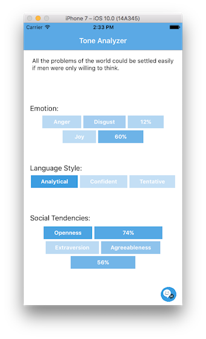

[](https://bluemix.net)
[](https://developer.apple.com/swift/)

# Create an iOS application in Swift which analyzes the emotion and tone of natural language

This Bluemix Mobile Starter will showcase the Tone Analyzer service from Watson and give you integration points for each of the Bluemix Mobile services.

## Requirements

* iOS 8.0+
* Xcode 9.0+
* Swift 3.2+ or Swift 4.0+

### Bluemix Mobile services Dependency Management

The Bluemix Mobile services SDK uses [CocoaPods](https://cocoapods.org/) to manage and configure dependencies. To use our latest SDKs you need version 1.1.0.rc.2.

You can install CocoaPods using the following command:

```bash
$ sudo gem install cocoapods --pre
```

If the CocoaPods repository is not configured, run the following command:

```bash
$ pod setup
```

For this starter, a pre-configured `Podfile` has been included in the **ios_swift/Podfile** location. To download and install the required dependencies, run the following command in the **ios_swift** directory:

```bash
$ pod install
```
Now Open the Xcode workspace: `{APP_Name}.xcworkspace`. From now on, open the `.xcworkspace` file because it contains all the dependencies and configurations.

If you run into any issues during the pod install, it is recommended to run a pod update by using the following commands:

```bash
$ pod update
$ pod install
```

> [View configuration](#configuration)

### Watson Dependency Management

This starter uses the Watson Developer Cloud iOS SDK in order to use the Watson Tone Analyzer service.

The Watson Developer Cloud iOS SDK uses [Carthage](https://github.com/Carthage/Carthage) to manage dependencies and build binary frameworks.

You can install Carthage with [Homebrew](http://brew.sh/):

```bash
$ brew update
$ brew install carthage
```

To use the Watson Developer Cloud iOS SDK in any of your applications, specify it in your `Cartfile`:

```
github "watson-developer-cloud/swift-sdk"
```

For this starter, a pre-configured `Cartfile` has been included in the **ios_swift/Cartfile** location

Run the following command to build the dependencies and frameworks:

```bash
$ carthage update --platform iOS
```

> **Note**: You may have to run `carthage update --platform iOS --no-use-binaries`, if the binary is a lower version than your current version of Swift.

Once the build has completed, the frameworks can be found in the **ios_swift/Carthage/Build/iOS/** folder. The Xcode project in this starter already includes framework links to the following frameworks in this directory:

* **ToneAnalyzerV3.framework**
* **RestKit.framework**


If you build your Carthage frameworks in a separate folder, you will have to drag-and-drop the above frameworks into your project and link them in order to run this starter successfully.

> [View configuration](#configuration)

### Watson Credential Management

Once the dependencies have been built and configured for the Bluemix Mobile service SDKs as well as the Watson Developer Cloud SDK, no more configuration is needed! A Watson Tone Analysis service has already been provisioned for you and your unique credentials were injected into the application during generation.

> [View configuration](#configuration)

## Run

You can now run the application on a simulator or physical device:




The application allows you to use the Watson Tone Analyzer service to analyze text. Tone Analyzer leverages cognitive linguistic analysis to identify a variety of tones at both the sentence and document level. This insight can then used to refine and improve communications. It detects three types of tones, including emotion (anger, disgust, fear, joy and sadness), social propensities (openness, conscientiousness, extroversion, agreeableness, and emotional range), and language styles (analytical, confident and tentative) from text. Enter text in the input text box and then click the Tone Analyzer button to see the results. The results will be shown under each category after the text has been analyzed. The tag visibility will change based on the percentage returned from Watson, but you can click on tag directly to see the exact percentage.

## License

[Apache 2.0](LICENSE)
